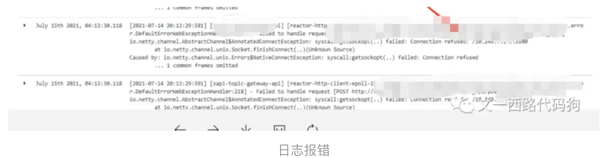
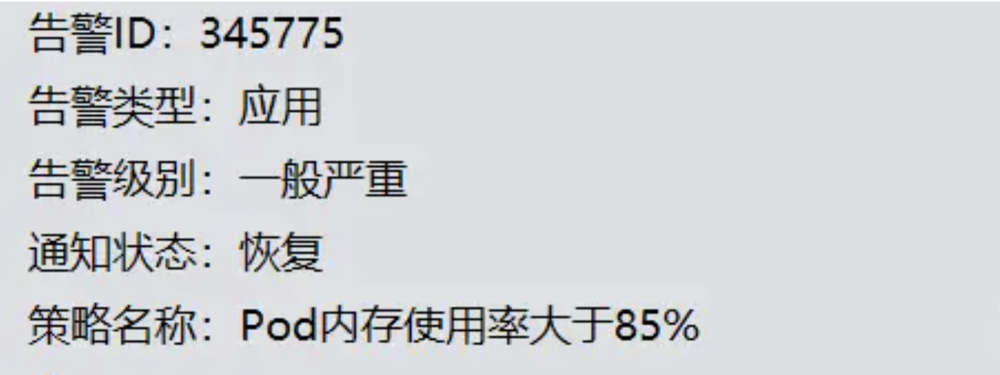
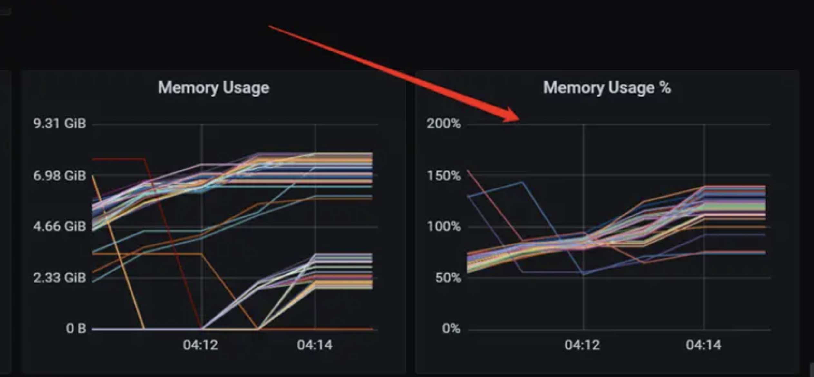
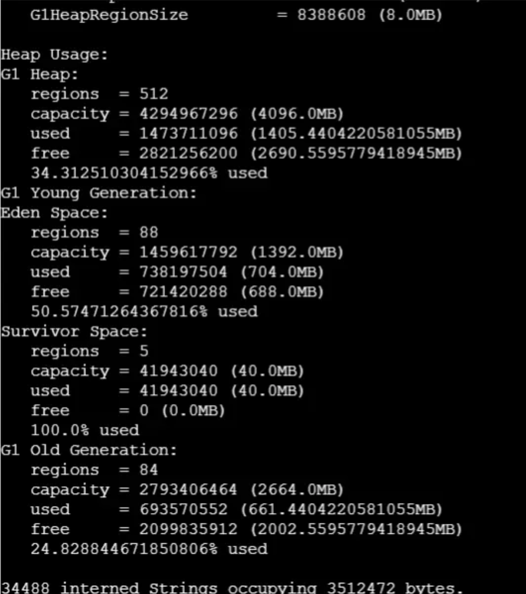
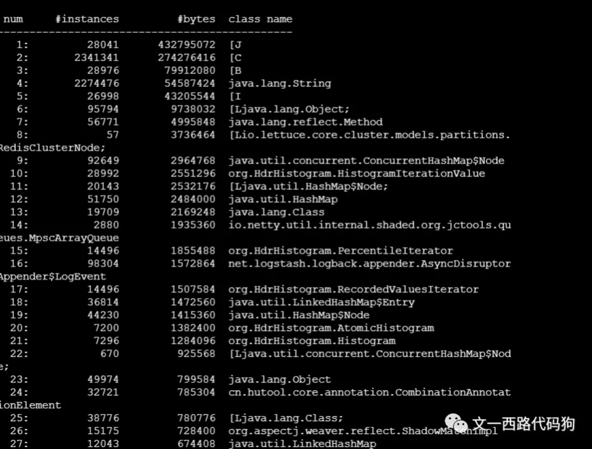

# 记一次JVM内存泄漏问题及解决（第一篇）

​    **目录**     

​      **一、背景简介**     

​      **二、发现问题**      

​      **三、问题追踪排查**     

​      **四、总结**

-- --
**一、背景简介**

内存泄漏（Memory Leak）是指程序中已动态分配的堆内存由于某种原因程序未释放或无法释放，造成系统内存的浪费，导致程序运行速度减慢甚至系统崩溃等严重后果。

在一次项目上线之后，经过系统不断运行，出现内存持续飙高，就排查出了一个内存泄漏的问题，现将问题及解决记录如下。

**二、发现问题**

在一次项目上线之后，刚开始短时间内没有发现任何问题，但是随着系统运行、流量请求，后来就收到了网关系统的报警：网关通过的QPS骤减。通过查看网关日志，发现大量请求通过网关路由连接失败了，如下：



​                                                    日志报错

很明显，这并不是网关的问题，而是通过网关route路由之后调用后端api服务失败了，随后也收到了后台api服务的报警，如下：



​													api服务的报警

如图所示，显然是后端api服务内存使用率太高了，发出严重告警，打开系统jvm进程内存监控，确实内存在持续飙高，并且居高不下。后端api服务一旦分配的jvm内存使用率达到100%，就会自动重启服务，所以网关那边的请求就会短时间内找不到后端api服务，出现大量error日志。


​																监控信息

因为刚推上线前几天流量不大，我们忙于其他紧急项目，所以直到这个报警推送给我们的时候我们才感知发现这个问题，于是紧急对这个问题进行了排查处理。

 **三、问题追踪排查**

因为内存持续飙高，并且居高不下，第一个想法猜测是不是出现了内存泄漏问题导致使用过的内存本来随着jvm的GC机制被回收，但是一直不释放，持有内存，导致内存随着时间不断累积，最后撑满内存。

所以先使用命令：

```clike
jmap -heap 1
```

去查看了一下jvm内存使用情况。




通过看jvm堆内存使用情况，并没有发现什么哪部分内存过高，然后再使用命令：

```clike
jmap -histo 1 | head -30
```

打印当前进程jvm内存实例数量及占用内存大小，也没有发现有什么特殊异常情况。



接下来就猜测很有可能是堆外内存泄漏，堆外内存一般有以下几种：

```clike
1、Metaspace-元数据区

2、栈区

3、codecache-编译成jvm指令的代码缓存

4、DirectByteBuffer->unsafe.allocateMemory->Native Code（C代码）申请内存
```

通过一一排查，最终使用命令：

```clike
jstack  -l  1 > /data/logs/jstack.log
```

将线程栈dump出来的时候在jstack文件中发现了异常:

```clike
"third-interface-1" #1551 prio=5 os_prio=0 tid=0x00007f8de0104800 nid=0x5a05 waiting on condition [0x00007f8cf2af1000]   java.lang.Thread.State: WAITING (parking)  at sun.misc.Unsafe.park(Native Method)  - parking to wait for  <0x00000000f3b661f0> (a java.util.concurrent.locks.AbstractQueuedSynchronizer$ConditionObject)  at java.util.concurrent.locks.LockSupport.park(LockSupport.java:175)  at java.util.concurrent.locks.AbstractQueuedSynchronizer$ConditionObject.await(AbstractQueuedSynchronizer.java:2039)  at java.util.concurrent.LinkedBlockingQueue.take(LinkedBlockingQueue.java:442)  at java.util.concurrent.ThreadPoolExecutor.getTask(ThreadPoolExecutor.java:1074)  at java.util.concurrent.ThreadPoolExecutor.runWorker(ThreadPoolExecutor.java:1134)  at java.util.concurrent.ThreadPoolExecutor$Worker.run(ThreadPoolExecutor.java:624)  at java.lang.Thread.run(Thread.java:748)

  Locked ownable synchronizers:  - None
"third-interface-1" #1550 prio=5 os_prio=0 tid=0x00007f8de0102800 nid=0x5a04 waiting on condition [0x00007f8cf2bf2000]   java.lang.Thread.State: WAITING (parking)  at sun.misc.Unsafe.park(Native Method)  - parking to wait for  <0x00000000f3b48088> (a java.util.concurrent.locks.AbstractQueuedSynchronizer$ConditionObject)  at java.util.concurrent.locks.LockSupport.park(LockSupport.java:175)  at java.util.concurrent.locks.AbstractQueuedSynchronizer$ConditionObject.await(AbstractQueuedSynchronizer.java:2039)  at java.util.concurrent.LinkedBlockingQueue.take(LinkedBlockingQueue.java:442)  at java.util.concurrent.ThreadPoolExecutor.getTask(ThreadPoolExecutor.java:1074)  at java.util.concurrent.ThreadPoolExecutor.runWorker(ThreadPoolExecutor.java:1134)  at java.util.concurrent.ThreadPoolExecutor$Worker.run(ThreadPoolExecutor.java:624)  at java.lang.Thread.run(Thread.java:748)
  Locked ownable synchronizers:  - None   ......
"third-interface-1" #1 prio=5 os_prio=0 tid=0x00007f8de0100800 nid=0x5a03 waiting on condition [0x00007f8cf2cf3000]   java.lang.Thread.State: WAITING (parking)  at sun.misc.Unsafe.park(Native Method)  - parking to wait for  <0x00000000f3b29c38> (a java.util.concurrent.locks.AbstractQueuedSynchronizer$ConditionObject)  at java.util.concurrent.locks.LockSupport.park(LockSupport.java:175)  at java.util.concurrent.locks.AbstractQueuedSynchronizer$ConditionObject.await(AbstractQueuedSynchronizer.java:2039)  at java.util.concurrent.LinkedBlockingQueue.take(LinkedBlockingQueue.java:442)  at java.util.concurrent.ThreadPoolExecutor.getTask(ThreadPoolExecutor.java:1074)  at java.util.concurrent.ThreadPoolExecutor.runWorker(ThreadPoolExecutor.java:1134)  at java.util.concurrent.ThreadPoolExecutor$Worker.run(ThreadPoolExecutor.java:624)  at java.lang.Thread.run(Thread.java:748)
  Locked ownable synchronizers:  - None
```

"third-interface-"是处理业务的线程池自定义的线程名称前缀，但是jstack文件中出现了大量的以third-interface-1开头的线程名称，但是线程id却在递增，第一眼看到这样的jstack线程dump文件内容还以为是自定义的线程池一直在使用同一个线程名称不断地创建线程执行往线程池中提交的任务，但是看了代码中线程池定义核心线程数量CorePoolSize是30，最大线程数量MaxPoolSize为100，根本不会出现只创建一个线程执行任务，使用的线程池是ThreadPoolTaskExecutor，不过既然jvm线程堆栈显示这里创建线程有问题-同一个线程名称，ID却在不断递增，那么问题就一定出现自定义的线程池ThreadPoolTaskExecutor的使用上，后来在查看ThreadPoolTaskExecutor在哪里使用的时候发现了问题所在，当时的业务代码是这样的

```java
List<Supplier<String>> taskList = Lists.newLinkedList();
    CopyOnWriteArrayList<PointPlaceVo> allList = Lists.newCopyOnWriteArrayList();
    //每10个pid分段截取
    int startIndex = 0;
    int endIndex;
    int limit = 10;
    //idList为总的id集合
    int size = idList.size();
    //开始位置小于总长度
    while(startIndex<size){    
        //尾部位置
        endIndex = startIndex + limit;    
        //尾部位置校验    
        endIndex = Math.min(endIndex, size);    
        //截取 拼接    
        List<String> subList = idList.subList(startIndex, endIndex);
        String subPid = String.join(",", subList);    
        //重置开始位置    
        startIndex = endIndex;
        String ord = getStringWithSeparator(subPid, ",", "0");
        String areaId = getStringWithSeparator(subPid, ",", cookieAreaId);
        String brandId = ord;
        String modelId = brandId;
        String keywordId = getStringWithSeparator(subPid, "||", "0");
        String url = advertisingPlaceConfig.getGetPointPlaceUrl() + "?pid=" + subPid + "&ord=" + ord + "&areaId=" + areaId + "&brandId=" + brandId + "&modelId=" + modelId + "&keywordId=" + keywordId + "&cs=" + cs + "&toJson=" + toJson + "&CIGDCID=" + CIGDCID + "&remoteIp=" + remoteIp + "&date=" + date + "&headerIp=" + headerIp;
        taskList.add(() -> factoryFacade.httpRequest(HttpMethod.GET).doRequest(url, httpEntity));
    }

    CountDownLatch countDownLatch = new CountDownLatch(taskList.size());
    taskList.forEach(task ->ThreadExecutorConfig.thirdServiceExecutor().execute(() ->{
        try {
            String body = task.get();
            if (Objects.nonNull(body)) {
                List<PointPlaceVo> pointPlaceVoList = JSONObject.parseObject(body, new TypeReference<List<PointPlaceVo>>() {
                });
                if (CollectionUtil.isNotEmpty(pointPlaceVoList)) {
                    allList.addAll(pointPlaceVoList);
                }
            }
        } finally {
            countDownLatch.countDown();
        }
    }));
```

这里是一个调用三方接口把idList以10个分为一批进行分批调用的，问题就出现在对taskList进行遍历进行批量调用的时候，直接调用的ThreadExecutorConfig.thirdServiceExecutor()方法的execute方法，进去ThreadExecutorConfig.thirdServiceExecutor()才发现线程池定义并不是一个单例的

```java
public class ThreadExecutorConfig {
    public static Executor thirdServiceExecutor() {
        ThreadPoolTaskExecutor executor = new ThreadPoolTaskExecutor();
        //配置核心线程数        
        executor.setCorePoolSize(30);
        // 配置最大线程数        
        executor.setMaxPoolSize(100);
        //配置队列大小       
        executor.setQueueCapacity(1000);
        // 设置线程活跃时间（秒）        
        executor.setKeepAliveSeconds(60);
        //设置默认线程名称前缀        
        executor.setThreadNamePrefix("third-interface-");
        //设置线程池组名        
        executor.setThreadGroupName("third-interface-thread-group");
        // rejection-policy：当pool已经达到max size的时候，如何处理新任务        
        // AbortPolicy：放弃        
        executor.setRejectedExecutionHandler(new ThreadPoolExecutor.AbortPolicy());        //执行初始化        executor.initialize();        return executor;    }}
    }
}
```

这里定义的ThreadExecutorConfig.thirdServiceExecutor()只是一个类的静态static方法，所以在调用这个类的静态thirdServiceExecutor()方法的时候，每次都是new 一个新对象ThreadPoolTaskExecutor，至于为什么写了个这样的代码我们不得而知，每次调用ThreadExecutorConfig.thirdServiceExecutor()的时候new 一个新对象ThreadPoolTaskExecutor，但是方法执行完出栈后new出来的新对象ThreadPoolTaskExecutor线程池并没有被回收，每次new 一个新对象ThreadPoolTaskExecutor的时候，第一个线程当然线程名称是jstack里面的那个线程名称：third-interface-1，然后下次taskList迭代遍历的时候又重新new一个新对象ThreadPoolTaskExecutor，第一个线程当然线程名称又是jstack里面的那个线程名称：third-interface-1，然而线程ID却在不断递增，所以就出现了jstack里面线程堆栈的那种现象，每次迭代创建一个线程池只创建一个线程并且只使用了一次，就进入下次迭代再次创建线程池了，后来修改后的代码很简单如下，让线程池变成单例的bean，每次使用的时候直接注入thirdServiceExecutor这个bean就行了：

```java
@Configuration
public class ThreadExecutorConfig {
    @Bean
    public static Executor thirdServiceExecutor() {
        ThreadPoolTaskExecutor executor = new ThreadPoolTaskExecutor();
        //配置核心线程数        
        executor.setCorePoolSize(30);
        // 配置最大线程数        
        executor.setMaxPoolSize(100);
        //配置队列大小        
        executor.setQueueCapacity(1000);
        // 设置线程活跃时间（秒）        
        executor.setKeepAliveSeconds(60);
        //设置默认线程名称前缀        
        executor.setThreadNamePrefix("third-interface-");
        //设置线程池组名        
        executor.setThreadGroupName("third-interface-thread-group");
        // rejection-policy：当pool已经达到max size的时候，如何处理新任务        
        // AbortPolicy：放弃        
        executor.setRejectedExecutionHandler(new ThreadPoolExecutor.AbortPolicy());
        //执行初始化        
        executor.initialize();
        return executor;
    }
}
```

这也是自定义线程池的常规用法。当然也可以有其他定义方式，归根结底就是要让线程池定义成单例的，这样才能在不同地方复用。

**四、总结**

其实对于内存泄漏，不管是堆内还是堆外内存泄漏，只要最终内存不够用，一定会打印异常信息：

```clike
Caused by: java.lang.OutOfMemoryError: Direct buffer memory
```

反之如果总内存使用量一直在递增，但是没有打印异常信息，但是服务jvm却down掉了，需要排查是否是其他原因导致的：线程一直在大量创建没有复用和回收、一直在创建对象没有回收、创建了很多大对象、创建了很多冗余对象、是否监控工具不准、网络io问题等等。