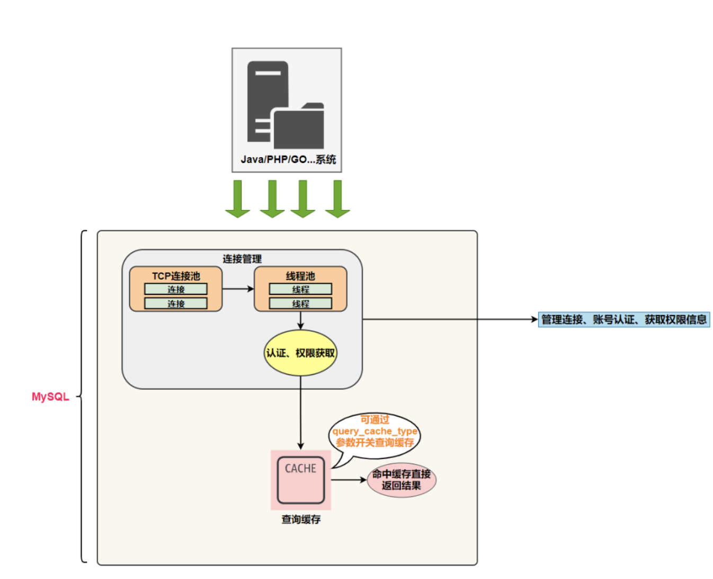

# 1.重学MySQL系列01-揭开面纱，显露架构

# 前言 

目前大部分的后端开发人员对`MySQL`的理解可能停留在一个黑盒子阶段。

对`MySQL`基本使用没什么问题，比如建库、建表、建索引，执行各种增删改查。

所有很多后端开发人员眼中的`MySQL`如下图所示

导致在实际工作中碰到`MySQL`中死锁异常、`SQL`性能太差、异常报错等问题时，直接百度搜索。

然后跟着博客捣鼓就解决了，可能自己都没搞明白里面的原理。

为了解决这种**知其然而不知其所以然**的问题，阿星的**重学MySQL系列**会带着大家去探索MySQL底层原理的方方面面。

这样大家碰到`MySQL`的一些异常或者问题时，能够直戳本质，快速地定位解决。

# 连接管理

系统（客户端）访问`MySQL`服务器前，做的第一件事就是建立`TCP`连接。

经过三次握手建立连接成功后，`MySQL`服务器对`TCP`传输过来的账号密码做身份认证、权限获取。

- **用户名或密码不对，会收到一个Access denied for user错误，客户端程序结束执行**
- **用户名密码认证通过，会从权限表查出账号拥有的权限与连接关联，之后的权限判断逻辑，都将依赖于此时读到的权限**

接着我们来思考一个问题

一个系统只会和`MySQL`服务器建立一个连接吗？

只能有一个系统和`MySQL`服务器建立连接吗？

当然不是，多个系统都可以和`MySQL`服务器建立连接，每个系统建立的连接肯定不止一个。

所以，为了解决`TCP`无限创建与`TCP`频繁创建销毁带来的资源耗尽、性能下降问题。

`MySQL`服务器里有专门的`TCP`连接池限制接数，采用长连接模式复用`TCP`连接，来解决上述问题。

`TCP`连接收到请求后，必须要分配给一个线程去执行，所以还会有个线程池，去走后面的流程。

这些内容我们都归纳到`MySQL`的**连接管理**组件中。

所以**连接管理**的职责是负责认证、管理连接、获取权限信息。

# 解析与优化

经过了连接管理，现在`MySQL`服务器已经获取到`SQL`字符串。

如果是查询语句，`MySQL`服务器会使用`select SQL`字符串作为`key`。

去缓存中获取，命中缓存，直接返回结果（**返回前需要做权限验证**），未命中执行后面的阶段，这个步骤叫**查询缓存**。

需要注意，`select SQL`字符串要完全匹配，有任何不同的地方都会导致缓存不被命中（**空格、注释、大小写、某些系统函数**）。

> 小贴士：虽然查询缓存有时可以提升系统性能，但也不得不因维护这块缓存而造成一些开销，从MySQL 5.7.20开始，不推荐使用查询缓存，并在MySQL 8.0中删除。

没有命中缓存，或者非`select SQL`就来到**分析器**阶段了。

因为系统发送过来的只是一段文本字符串，所以`MySQL`服务器要按照`SQL`语法对这段文本进行解析。

如果你的`SQL`字符串不符合语法规范，就会收到`You have an error in your SQL syntax`错误提醒

通过了**分析器**，说明`SQL`字符串符合语法规范，现在`MySQL`服务器要执行`SQL`语句了。

`MySQL`服务器要怎么执行呢？

你需要产出执行计划，交给`MySQL`服务器执行，所以来到了**优化器**阶段。

优化器不仅仅只是生成执行计划这么简单，这个过程它会帮你优化`SQL`语句。

如**外连接转换为内连接、表达式简化、子查询转为连接、连接顺序、索引选择**等一堆东西，优化的结果就是执行计划。

截止到现在，还没有真正去读写真实的表，仅仅只是产出了一个执行计划。

于是就进入了**执行器**阶段，`MySQL`服务器终于要执行`SQL`语句了。

开始执行的时候，要先判断一下对这个表有没有相应的权限，如果没有，就会返回权限错误。

如果有权限，根据执行计划调用存储引擎`API`对表进行的读写。

存储引擎`API`只是抽象接口，下面还有个**存储引擎层**，具体实现还是要看表选择的存储引擎。

讲到这里，上面提到的**查询缓存、分析器、优化器、执行器**都可以归纳到`MySQL`的**解析与优化**组件中。

所以**解析与优化**的职责如下：

- **缓存**
- **SQL语法解析验证**
- **SQL优化并生成执行计划**
- **根据执行计划调用存储引擎接口**

其中**连接管理**与**解析与优化**处于`MySQL`架构中的`Server`层。

# 小结

在学习任何知识前，先不要着急的陷入细节，而是先了解大致脉络，有个全局观，之后再去深入相关的细节。

`MySql`架构分为`Servce`层与**存储引擎**层。

**连接管理、解析与优化**这些并不涉及读写表数据的组件划分到`Servce`层，读写表数据而是交给**存储引擎层**来做。

通过这种架构设计，我们发现`Servce`层其实就是公用层，**存储引擎层**就是多态层，按需选择具体的存储引擎。

再细想下，它和**模板方法设计模式**一摸一样，它们的执行流程是固定的，`Servce`层等于公用模板函数，**存储引擎层**等于抽象模板函数，按需子类实现。

阿星最后以一张`MySQL`简化版的架构图结束本文，我们下期再见~

站在巨人的肩膀上：

- 《MySQL实战45讲》
- 《从零开始带你成为MySQL实战优化高手》
- 《MySQL是怎样运行的：从根儿上理解MySQL》
- 《MySQL技术Innodb存储引擎》