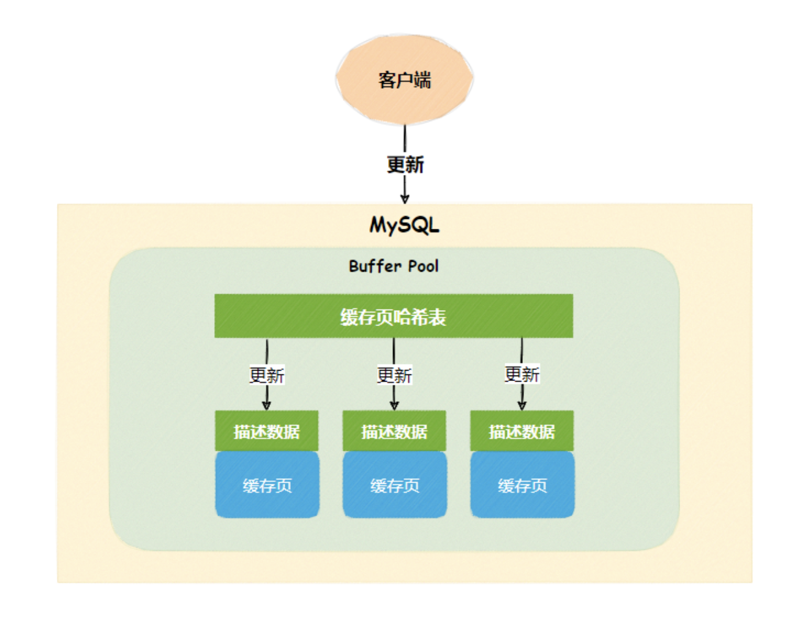
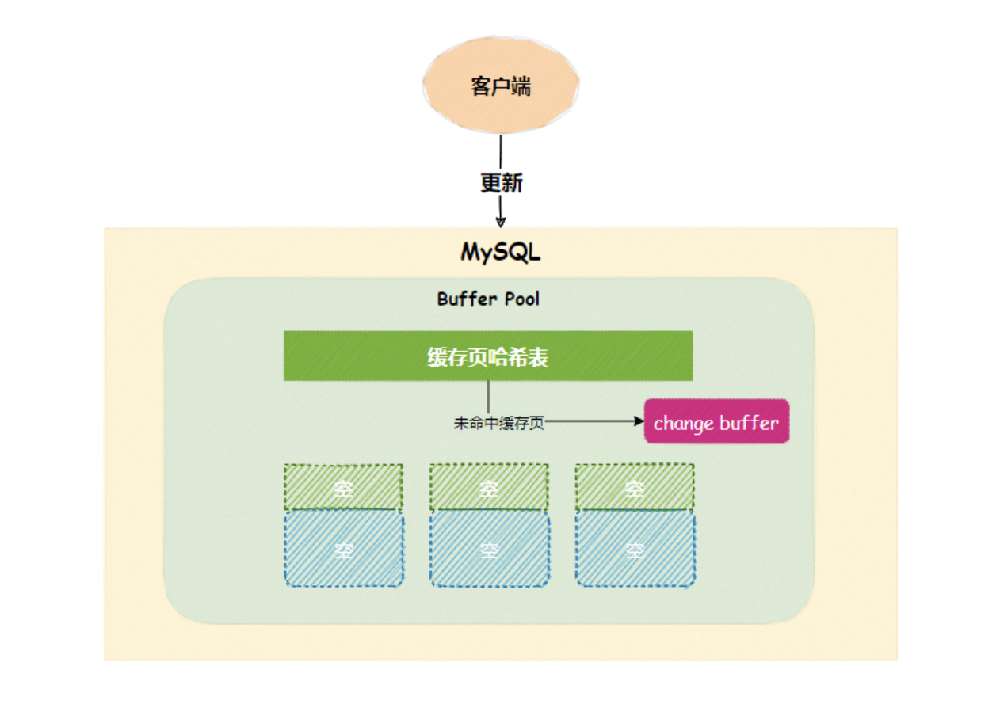
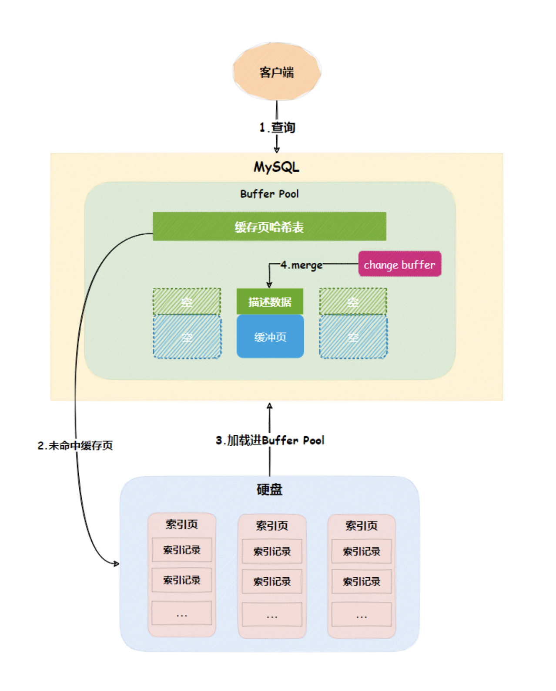
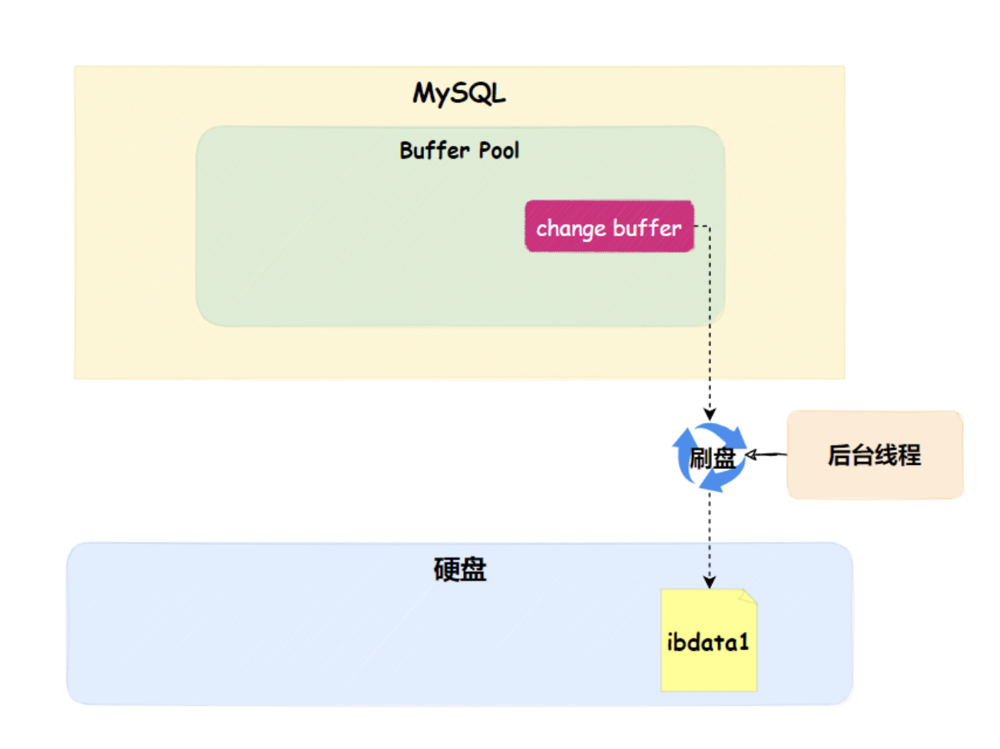
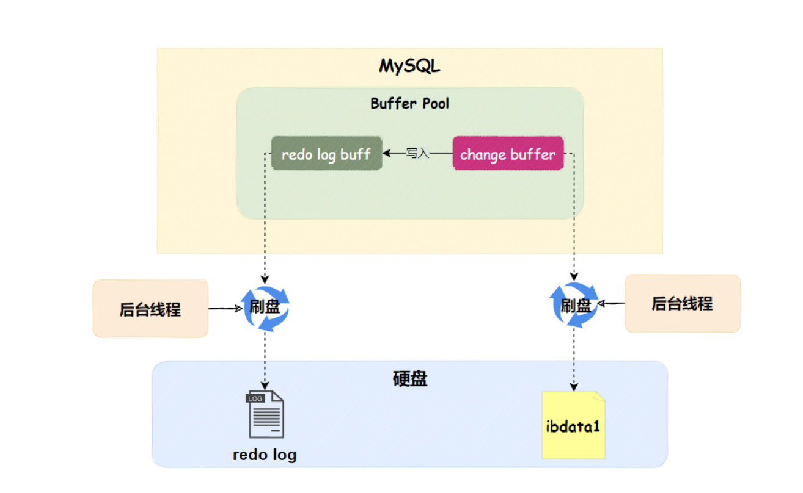
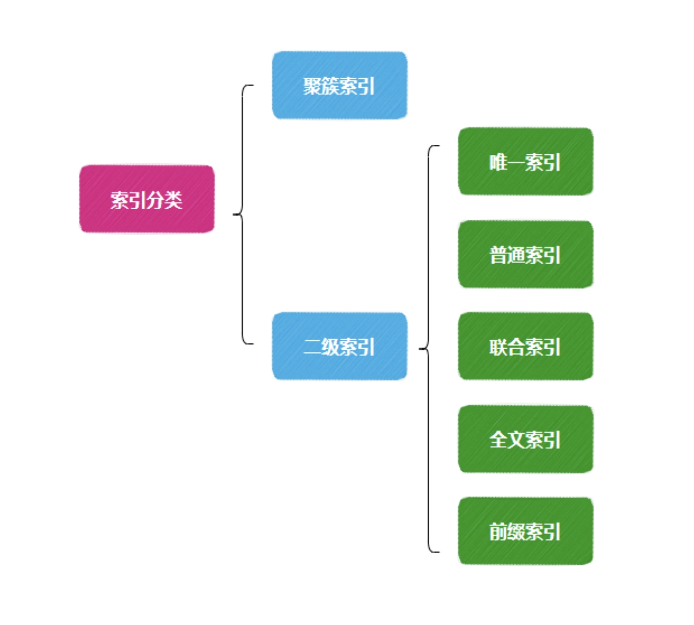
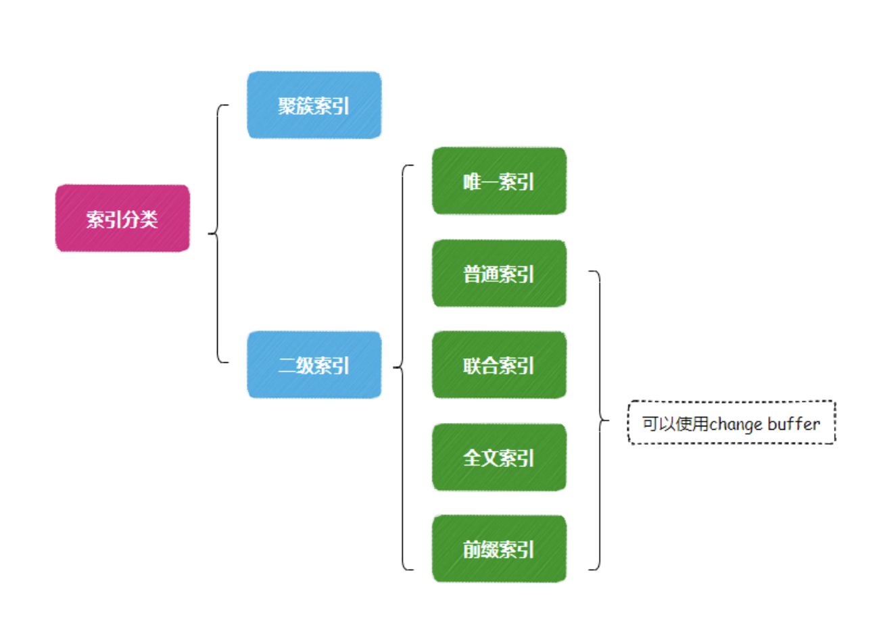
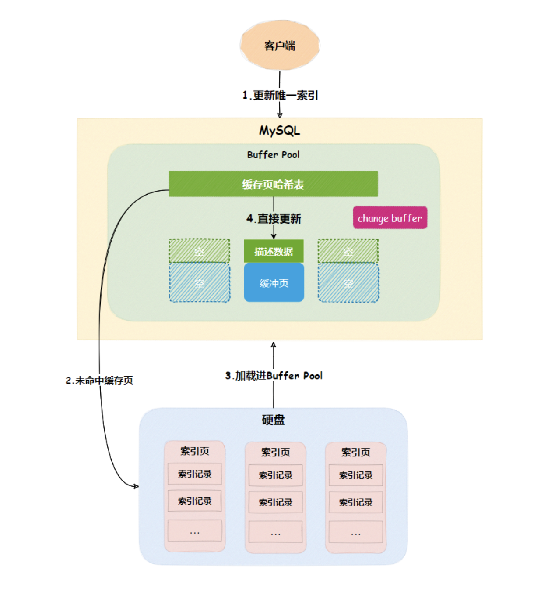
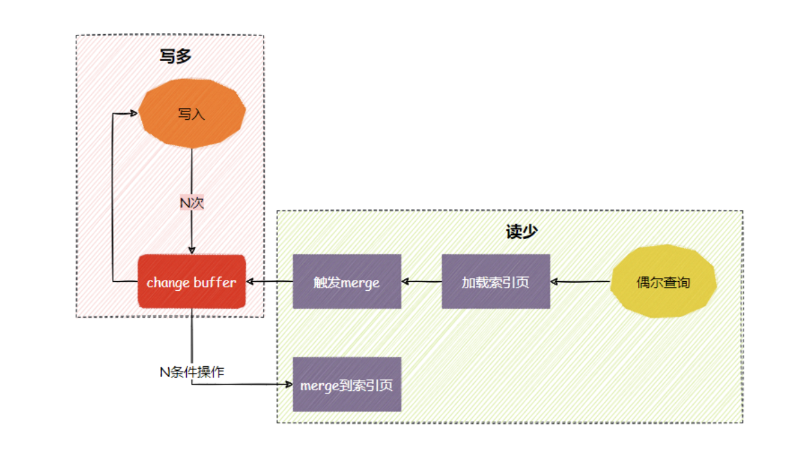
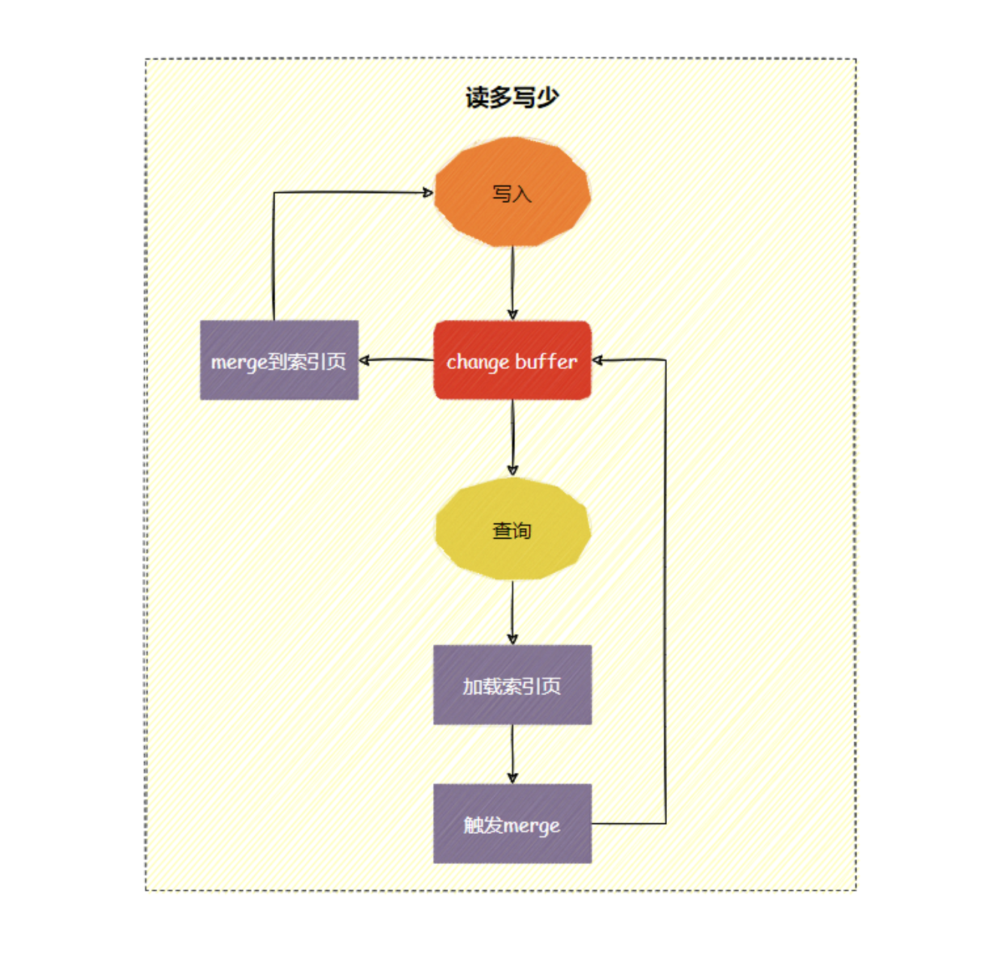

# InnoDB原理篇：Change Buffer是如何提升索引性能的？

# 前言

相信很多小伙伴设计索引时，考虑更多的是**索引是否能覆盖大部分的业务场景**，却忽略了**索引的性能**。

什么？不同的索引，性能还不一样？

是的，这要从`change buffer`说起。

# Change Buffer是什么

`MySQL`在启动成功后，会向内存申请一块内存空间，这块内存空间称为`Buffer Pool`。

`Buffer Pool`内维护了很多内容，比如**缓存页、各种链表、redo log buff、change buffer等等**。

回到正题，`change buffer`是用来干嘛的？

当索引字段内容发生更新时（`update、insert、delete`），要更新对应的**索引页**，如果**索引页**在`Buffer Pool`里命中的话，就直接更新**缓存页**。

否则，`InnoDB`会将这些更新操作缓存在`change buffer`中，这样就无需从硬盘读入**索引页**。

下次查询索引页时，会将索引页读入`Buffer Pool`，然后将`change buffer`中的操作应用到对应的缓存页，得到最新结果，这个过程称为`merge`，通过这种方式就能保证数据逻辑的正确性。

不难看出，`change buffer`通过**减少硬盘随机IO读**与**提高内存利用率**，让数据库的并发能力更强。

如果不了解**Buffer Pool、redo log、索引页**是什么，可以看看阿星之前写的几篇文章

- [聊聊redo log是什么？](https://mp.weixin.qq.com/s?__biz=MzAwMDg2OTAxNg==&mid=2652054699&idx=1&sn=018017d9f3a61ca284970bbf65ea5138&scene=21#wechat_redirect)
- [不会吧，不会吧，还有人不知道 binlog ？](https://mp.weixin.qq.com/s?__biz=MzAwMDg2OTAxNg==&mid=2652054835&idx=1&sn=cf863301f04d82f0c6ad4308ec8a55a3&scene=21#wechat_redirect)
- [redo log与binlog间的破事](https://mp.weixin.qq.com/s?__biz=MzAwMDg2OTAxNg==&mid=2652054869&idx=1&sn=b7ca964517c40a7ef990760ff659ac65&scene=21#wechat_redirect)
- [InnoDB原理篇：Buffer Pool为了让MySQL变快都做了什么](https://mp.weixin.qq.com/s?__biz=MzAwMDg2OTAxNg==&mid=2652054938&idx=1&sn=3cf39464e9589caf9c1c34053372b8cd&scene=21#wechat_redirect)
- [InnoDB原理篇：聊聊数据页变成索引这件事](https://mp.weixin.qq.com/s?__biz=MzAwMDg2OTAxNg==&mid=2652055534&idx=1&sn=6bce05f55b7a290a16e71d3885bfbaf0&scene=21#wechat_redirect)

## 持久化

看到这里小伙伴有疑问了，`change buffer`在内存中，如果万一`MySql`实例挂了或宕机了，这次的更新操作不全丢了吗？

其实不用担心，`InnoDB`对这块有相应的持久化方案，会有后台线程定期把`change buffer`持久化到硬盘的系统表空间（`ibdata1`）。

并且每次`change buffer`记录的内容，会写入到`redo log buff`中，由后台线程定期将`redo log buff`持久化到硬盘的`redolog`日志。

最后`MySql`重启，可以通过`ibdata1`或`redolog`恢复`change buffer`，恢复的过程，分为下面几种情况

1. `change buffer`的数据刷盘到`ibdata`，直接根据`ibdata`恢复

2. `change buffer`的数据未刷盘，`redolog`里记录了`change buffer`的内容

3. - `change buffer`写入`redo log`，`redo log`虽做了刷盘但未`commit`,`binlog`未刷盘,这部分数据丢失
   - `change buffer`写入`redolog`，`redolog`虽做了刷盘但未`commit`,`binlog`已刷盘,先从`binlog`恢复`redolog`,再从`redolog`恢复`change buffe`
   - `change buffer`写入`redolog`，`redolog`和`binlog`都已刷盘，直接从`redolog`里恢复。

如果不清楚`redolog`与`binlog`的可以看看下面这几篇文章

- [3-聊聊redo log是什么？](https://mp.weixin.qq.com/s?__biz=MzAwMDg2OTAxNg==&mid=2652054699&idx=1&sn=018017d9f3a61ca284970bbf65ea5138&scene=21#wechat_redirect)
- [4-不会吧，不会吧，还有人不知道 binlog ？](https://mp.weixin.qq.com/s?__biz=MzAwMDg2OTAxNg==&mid=2652054835&idx=1&sn=cf863301f04d82f0c6ad4308ec8a55a3&scene=21#wechat_redirect)
- [5-redo log与binlog间的破事](https://mp.weixin.qq.com/s?__biz=MzAwMDg2OTAxNg==&mid=2652054869&idx=1&sn=b7ca964517c40a7ef990760ff659ac65&scene=21#wechat_redirect)

# 如何使用Change Buffer

看到这里，相信大家对`change buffer`有了基本的认识。

现在可以展开讲讲`change buffer`的使用限制。

是的，你没听错，`change buffer`不能随随便便用。

一般我们可以把常用索引分类为下面几种

其中**聚簇索引**和**唯一索引**是无法使用`change buffer`，因为它们具备**唯一性**。

当更新**唯一索引**字段的内容时，需要把相应的索引页加载进`Buffer Pool`，验证唯一性约束，此时都已经读入到`Buffer Pool`了，那直接更新会更快，没必要使用`change buffer`。

也就是说，只有非唯一索引才能使用`change buffer`

## 业务场景

那现在有一个问题，使用`change buffer`一定可以起到加速作用吗？

相信大家都清楚`merge`的时候是将`change buffer`记录的操作应用到索引页。

所以索引页`merge`之前，`change buffer`记录的越多收益就越大。

因此对于写多读少的业务场景，索引页在写完以后马上被访问到的概率很小，此时`change buffer`的收益最高。

相反，读多写少的业务场景，更新完马上做查询，则会触发`change buff`立即`merge`, 不但硬盘随机`IO次`没有减少，还增加`change buffer`的维护成本。

因此`change buff`适合写多读少的业务场景

## 选择索引

由于唯一索引用不上`change buffer`的优化机制，在业务可以接受的情况下，从性能角度出发建议考虑**非唯一索引**

如果所有的更新后面，都马上伴随着对这个记录的查询，应该关闭`change buffer`，`innodb_change_buffering`设置为`none`表示关闭`change buffer`。

而在其他情况下`change buffer`都能提升更新性能。

我们可以通过`innodb_change_buffer_max_size`来动态设置`change buffer`占用的内存大小，假设参数设置为`50`的时候，表示`change buffer`的大小最多只能占用`buffer pool`的 `50%`。

最后留个思考题，如果知道`redo log`一定清楚`WAL`机制，`change buffer`与`WAL`分别提升性能的侧重点是什么？