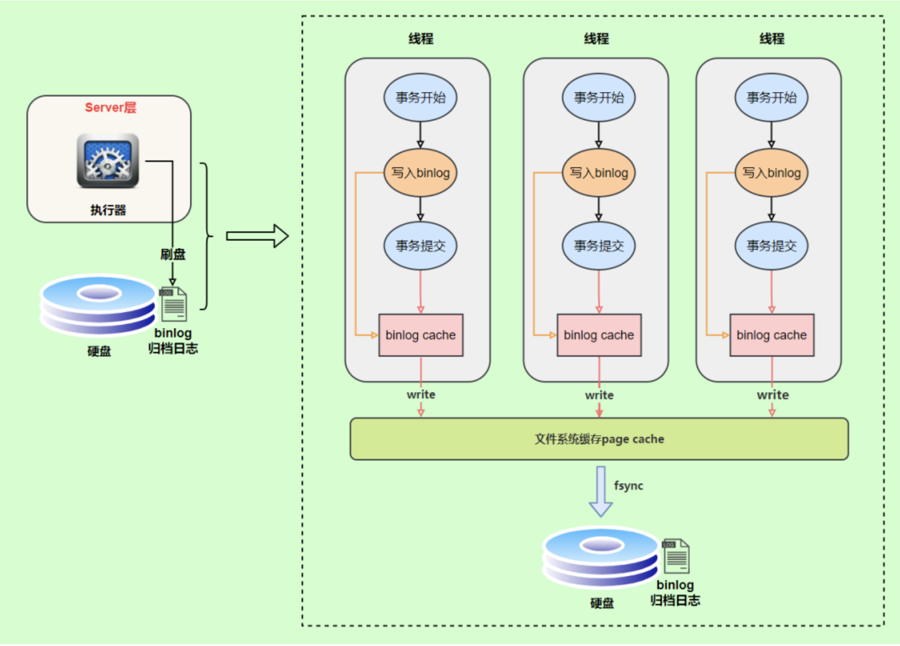
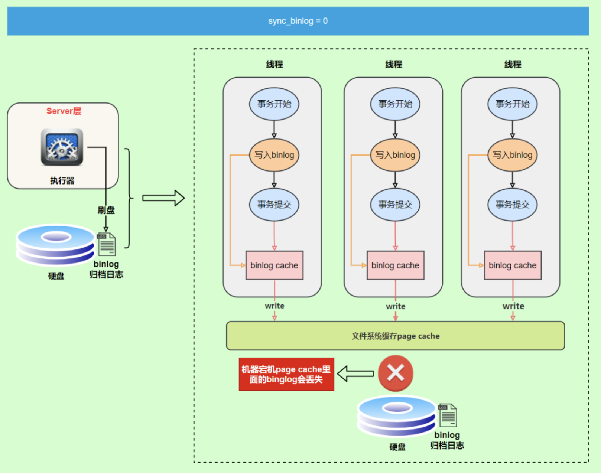
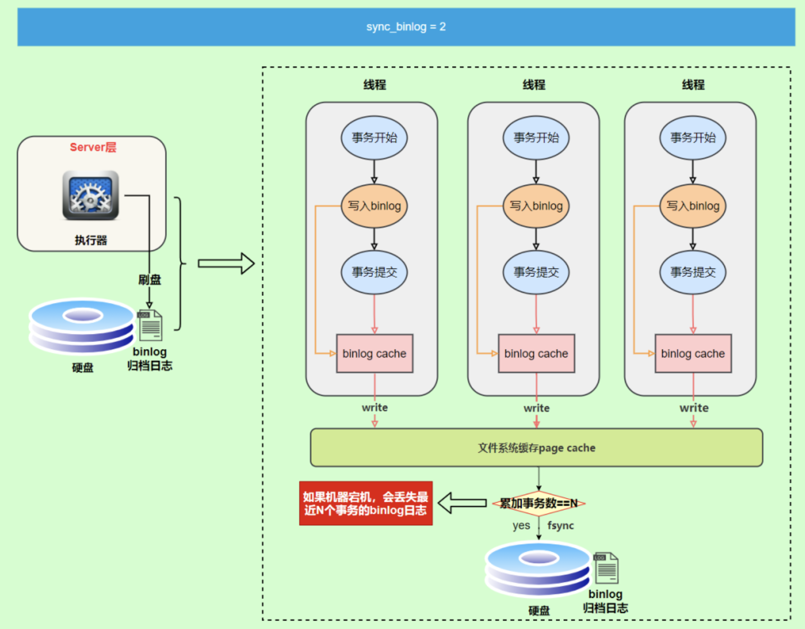

# 4.不会吧，不会吧，还有人不知道 binlog ？

# 前言

上篇阿星详细聊了[`redo log`（重做日志）](https://mp.weixin.qq.com/s?__biz=MzAwMDg2OTAxNg==&mid=2652054699&idx=1&sn=018017d9f3a61ca284970bbf65ea5138&scene=21#wechat_redirect) ，但是在`MySQL`数据库中还有一种二进制日志叫`binlog`（归档日志）。

`redo log`它是物理日志，记录内容是“在某个数据页上做了什么修改”，属于`InnoDB`存储引擎。

而`binlog`是逻辑日志，记录内容是语句的原始逻辑，类似于“给ID=2这一行的c字段加1”，属于`MySQL Server`层。

# binlog

不管用什么存储引擎，只要发生了表数据更新，都会产生`binlog`日志。

那`binlog`到底是用来干嘛的？

可以说`MySQL`数据库的**数据备份、主备、主主、主从**都离不开`binlog`，需要依靠`binlog`来同步数据，保证数据一致性。

`binlog`会记录所有涉及更新数据的逻辑操作，并且是顺序写。

## 记录格式

`binlog`日志有三种格式，可以通过`binlog_format`参数指定。

- **statement**
- **row**
- **mixed**

指定`statement`，记录的内容是`SQL`语句原文，比如执行一条`update T set update_time=now() where id=1`，记录的内容如下。

同步数据时，会执行记录的`SQL`语句，但是有个问题，`update_time=now()`这里会获取当前系统时间，直接执行会导致与原库的数据不一致。

为了解决这种问题，我们需要指定为`row`，记录的内容不再是简单的`SQL`语句了，还包含操作的具体数据，记录内容如下。

`row`格式记录的内容看不到详细信息，要通过`mysqlbinlog`工具解析出来。

`update_time=now()`变成了具体的时间`update_time=1627112756247`，条件后面的@1、@2、@3都是该行数据第1个~3个字段的原始值（**假设这张表只有3个字段**）。

这样就能保证同步数据的一致性，通常情况下都是指定为`row`，这样可以为数据库的恢复与同步带来更好的可靠性。

但是这种格式，需要更大的容量来记录，比较占用空间，恢复与同步时会更消耗`IO`资源，影响执行速度。

所以就有了一种折中的方案，指定为`mixed`，记录的内容是前两者的混合。

`MySQL`会判断这条`SQL`语句是否可能引起数据不一致，如果是，就用`row`格式，否则就用`statement`格式。

## 写入机制

`binlog`的写入时机也非常简单，事务执行过程中，先把日志写到`binlog cache`，事务提交的时候，再把`binlog cache`写到`binlog`文件中。

因为一个事务的`binlog`不能被拆开，无论这个事务多大，也要确保一次性写入，所以系统会给每个线程分配一个块内存作为`binlog cache`。

我们可以通过`binlog_cache_size`参数控制单个线程`binlog cache`大小，如果存储内容超过了这个参数，就要暂存到磁盘（`Swap`）。

`binlog`日志刷盘流程如下

- **上图的write，是指把日志写入到文件系统的page cache，并没有把数据持久化到磁盘，所以速度比较快**
- **上图的fsync，才是将数据持久化到磁盘的操作**

`write`和`fsync`的时机，可以由参数`sync_binlog`控制，默认是`0`。

为`0`的时候，表示每次提交事务都只`write`，由系统自行判断什么时候执行`fsync`。

虽然性能得到提升，但是机器宕机，`page cache`里面的`binglog`会丢失。

为了安全起见，可以设置为`1`，表示每次提交事务都会执行`fsync`，就如同**redolog日志刷盘流程**一样。

最后还有一种折中方式，可以设置为`N(N>1)`，表示每次提交事务都`write`，但累积`N`个事务后才`fsync`。

在出现`IO`瓶颈的场景里，将`sync_binlog`设置成一个比较大的值，可以提升性能。

同样的，如果机器宕机，会丢失最近`N`个事务的`binlog`日志。

# MySQL好文推荐

- [CURD这么多年，你有了解过MySQL的架构设计吗？](https://mp.weixin.qq.com/s?__biz=MzAwMDg2OTAxNg==&mid=2652054134&idx=1&sn=79c0e8f7933815d822d9c2a36dc77401&scene=21#wechat_redirect)
- [浅谈 MySQL InnoDB 的内存组件](https://mp.weixin.qq.com/s?__biz=MzAwMDg2OTAxNg==&mid=2652054485&idx=1&sn=cd6bead326dc5f5d8cf6af16893e9676&scene=21#wechat_redirect)
- [聊聊redo log是什么？](https://mp.weixin.qq.com/s?__biz=MzAwMDg2OTAxNg==&mid=2652054699&idx=1&sn=018017d9f3a61ca284970bbf65ea5138&scene=21#wechat_redirect)

# 站在巨人的肩膀上

- 《MySQL实战45讲》
- 《从零开始带你成为MySQL实战优化高手》
- 《MySQL技术Innodb存储引擎》