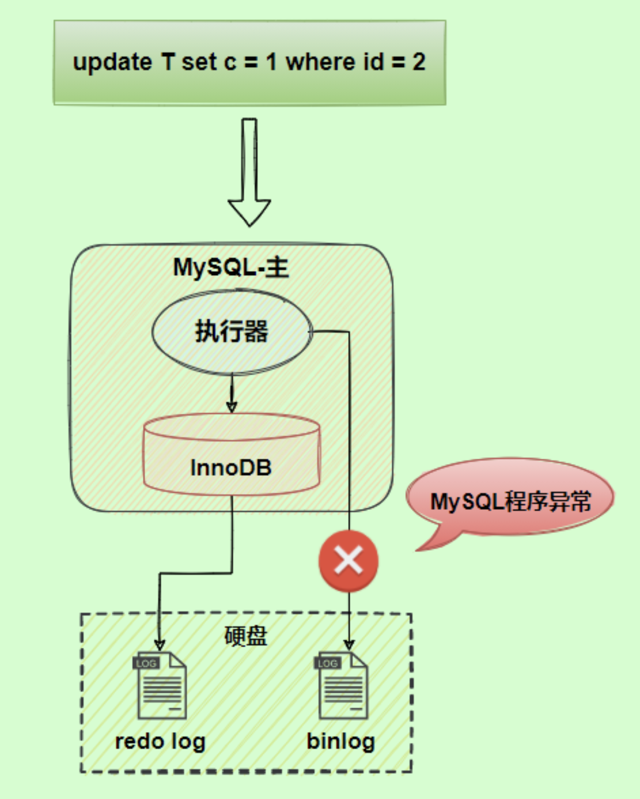
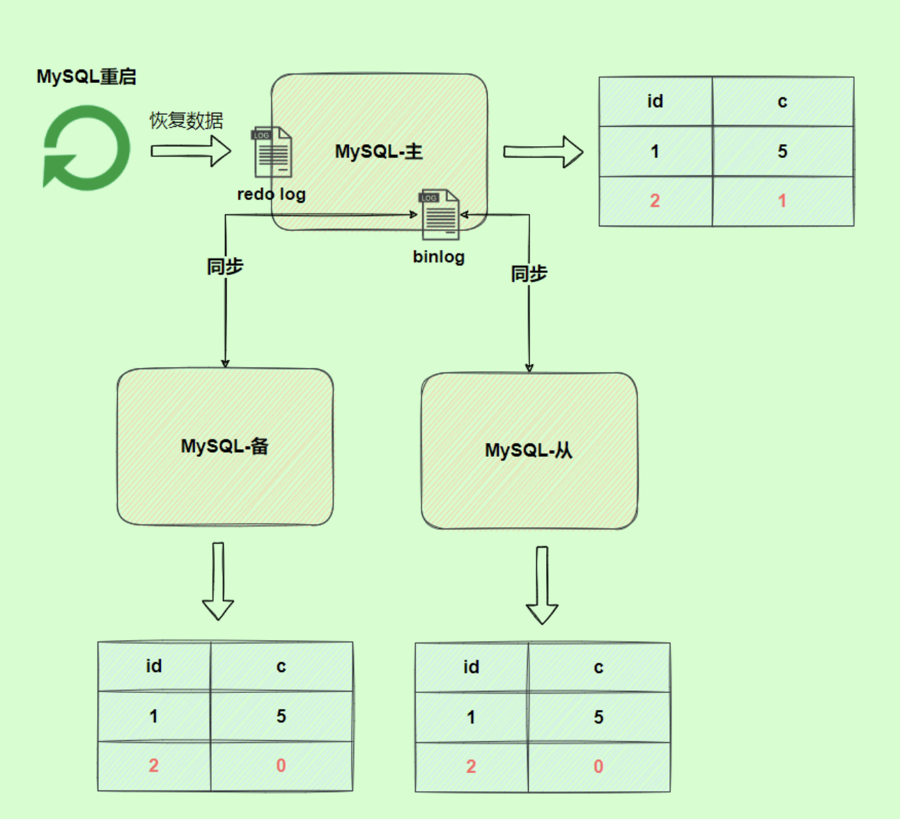
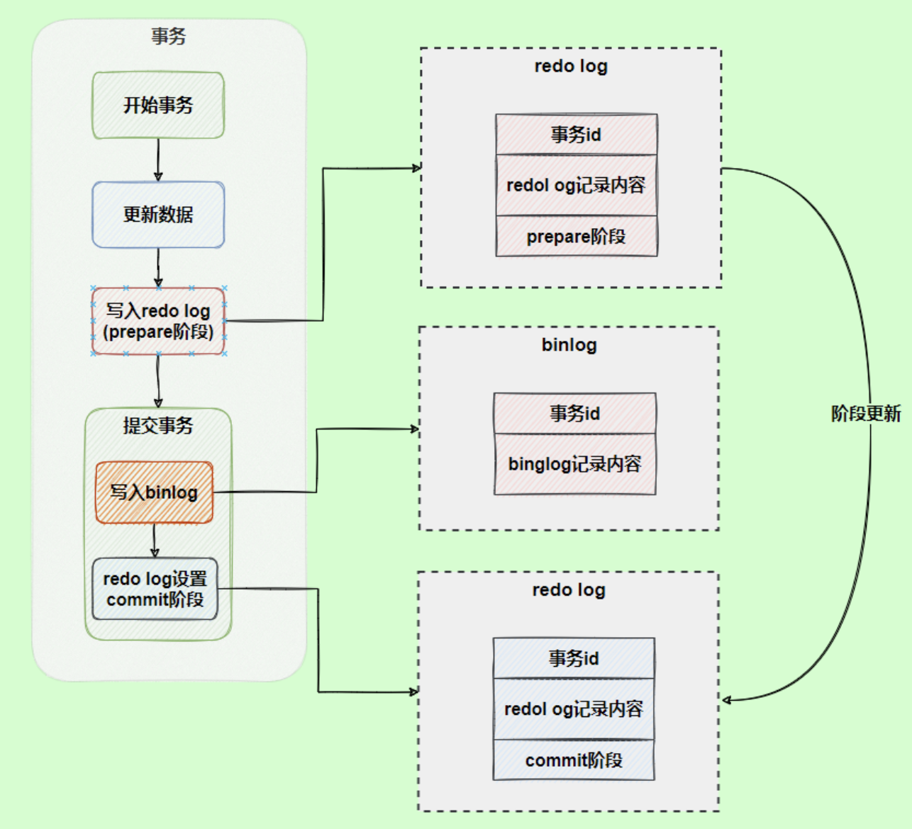
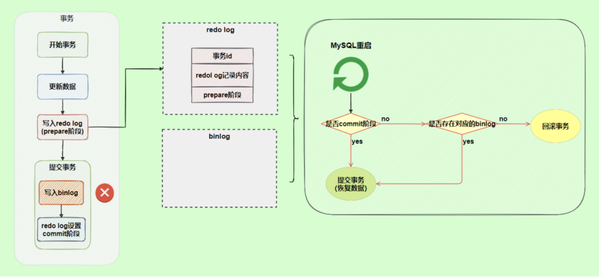
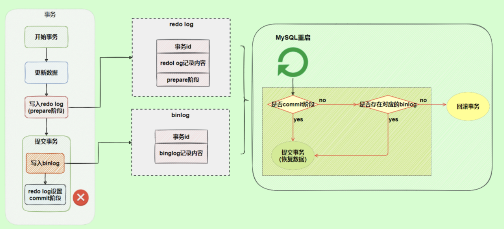

# redo log与binlog间的破事

# 前言

阿星在前面两篇文章都详细聊过`redo log`与`binlog`，有兴趣的朋友可以去看看前面两篇文章：

- [聊聊redo log是什么？](https://mp.weixin.qq.com/s?__biz=MzAwMDg2OTAxNg==&mid=2652054485&idx=1&sn=cd6bead326dc5f5d8cf6af16893e9676&scene=21#wechat_redirect)
- [你必须知道的binlog日志](https://mp.weixin.qq.com/s?__biz=MzAwMDg2OTAxNg==&mid=2652054485&idx=1&sn=cd6bead326dc5f5d8cf6af16893e9676&scene=21#wechat_redirect)

今天就来聊聊`InnoDB`是如何保证`redo log`与`binlog`两份日志之间的逻辑一致。

# 两阶段提交

`redo log`（重做日志）让`InnoDB`存储引擎拥有了崩溃恢复能力。

`binlog`（归档日志）保证了`MySQL`集群架构的数据一致性。

虽然它们都属于持久化的保证，但是则重点不同。

在执行更新语句过程，会记录`redo log`与`binlog`两块日志，以基本的事务为单位，`redo log`在事务执行过程中可以不断写入，而`binlog`只有在提交事务时才写入，所以`redo log`与`binlog`的写入时机不一样。

回到正题，`redo log`与`binlog`两份日志之间的逻辑不一致，会出现什么问题？

我们以`update`语句为例，假设`id=2`的记录，字段`c`值是`0`，把字段`c`值更新成`1`，`SQL`语句为`update T set c=1 where id=2`。

假设执行过程中写完`redo log`日志后，`binlog`日志写期间发生了异常，会出现什么情况呢？

由于`binlog`没写完就异常，这时候`binlog`里面没有对应的修改记录。因此，之后用`binlog`日志恢复数据时，就会少这一次更新，恢复出来的这一行`c`值是`0`，而原库因为`redo log`日志恢复，这一行`c`值是`1`，最终数据不一致。

为了解决两份日志之间的逻辑一致问题，`InnoDB`存储引擎使用**两阶段提交**方案。

原理很简单，将`redo log`的写入拆成了两个步骤`prepare`和`commit`，这就是**两阶段提交**。

使用**两阶段提交**后，写入`binlog`时发生异常也不会有影响，因为`MySQL`根据`redo log`日志恢复数据时，发现`redo log`还处于`prepare`阶段，并且没有对应`binlog`日志，就会回滚该事务。

再看一个场景，`redo log`设置`commit`阶段发生异常，那会不会回滚事务呢？

并不会回滚事务，它会执行上图框住的逻辑，虽然`redo log`是处于`prepare`阶段，但是能通过事务`id`找到对应的`binlog`日志，所以`MySQL`认为是完整的，就会提交事务恢复数据。

# 站在巨人的肩膀上

- 《MySQL实战45讲》
- 《从零开始带你成为MySQL实战优化高手》
- 《MySQL技术Innodb存储引擎》