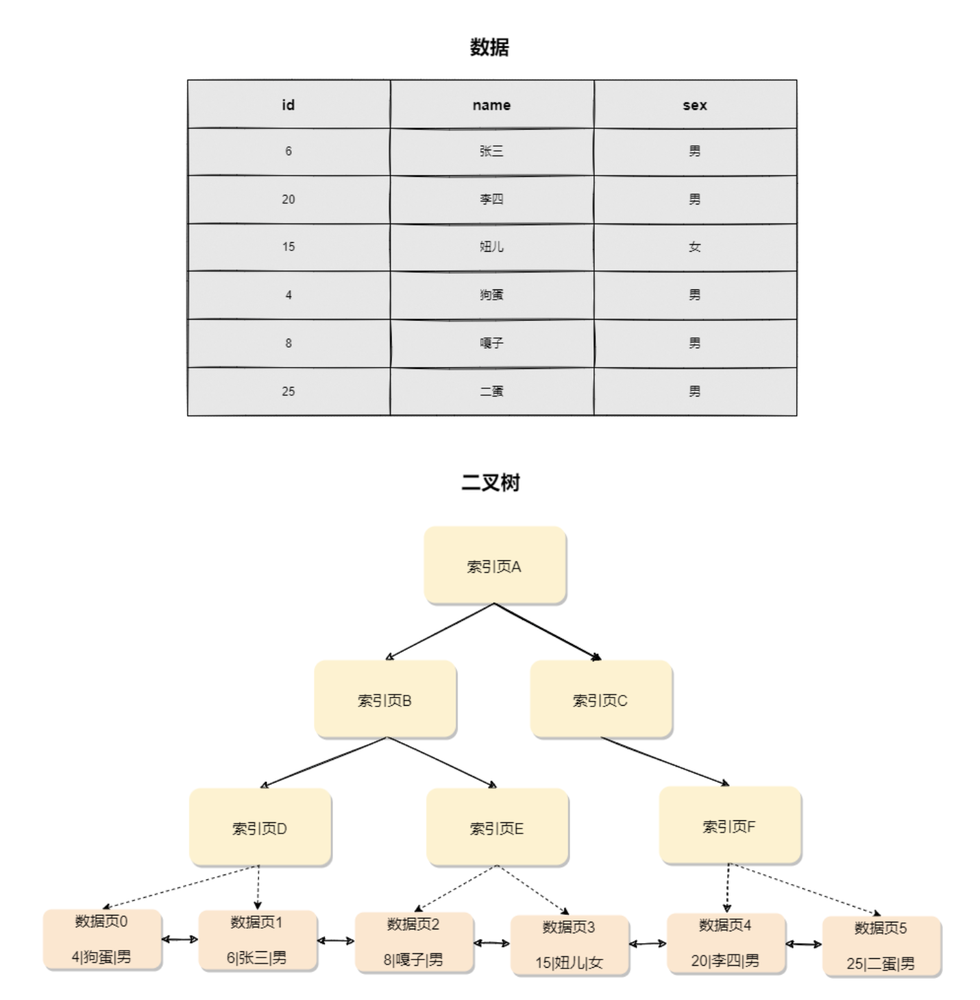
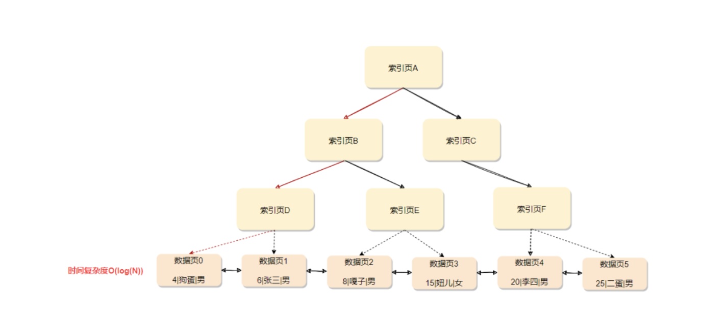
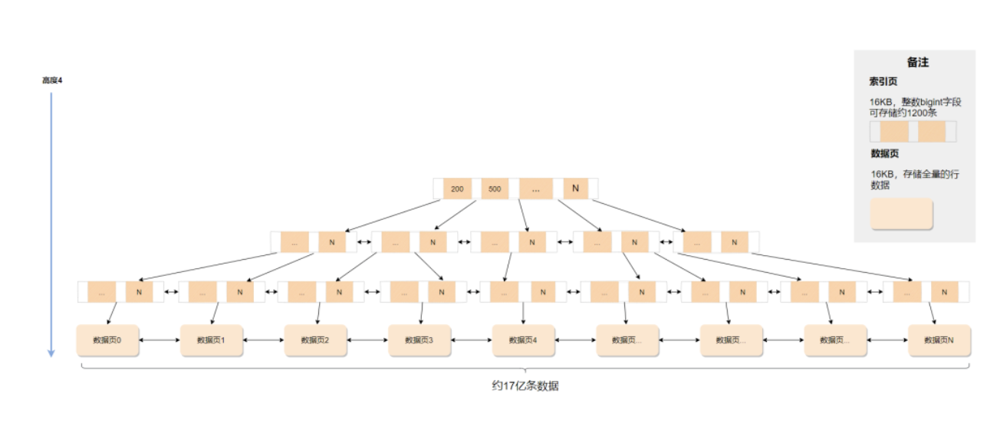
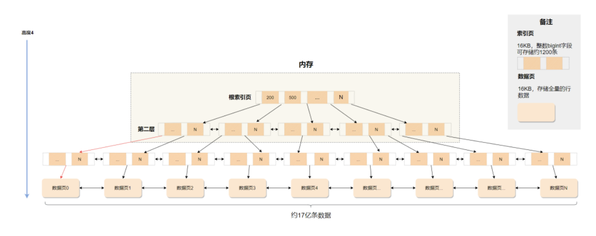
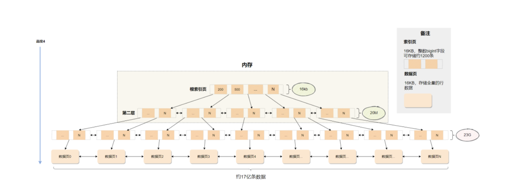

# 8.InnoDB原理篇：为什么使用索引会变快?

# 前言

本文就接上一篇文章【[InnoDB原理篇：聊聊数据页变成索引这件事](https://mp.weixin.qq.com/s?__biz=MzAwMDg2OTAxNg==&mid=2652055534&idx=1&sn=6bce05f55b7a290a16e71d3885bfbaf0&scene=21#wechat_redirect)】来聊聊索引。

建议看完上篇文章再看本篇，食用效果最佳。

# 索引

假设给你一本非常厚的《Java编程思想》阅读，没有目录，你想快速找到某一个章节的知识点，那估计得找一会了，如果有目录就不一样。

**索引其实就是为了提高数据查询的效率，就像书的目录一样**，对于数据库的表而言，索引其实就是它的**目录**。

## 二叉搜索树

索引的实现种类繁多，比如常见的有序数组、哈希表、树等，不同的结构都有自己的适用场景和局限性，在数据库领域中，**树结构**是被广泛使用。

我们先从最基本的**二叉搜索树**说起。

二叉搜索树的特点是：**父节点左子树所有结点的值小于父节点的值，右子树所有结点的值大于父节点的值**，如下图所示

如果要查`id=4`的数据，按照图中的搜索顺序是`索引页A -> 索引页B -> 索引页D -> 数据页0`，时间复杂度是`O(log(N))`。

也就是说，搜索速度与高度有关，树越高，性能越差，假设`100`万行的表，使用二叉树来存储，树高`20`，磁盘每次随机读一个数据块需要`10ms`左右，单独访问一个行可能需要`20`个`10ms`的时间，这个查询可真够慢的。

## N叉搜索树

为了减少磁盘随机读`IO`，就必须控制好树的高度，那就不应该使用二叉树，而是使用**N叉树**，这里的`N`代表数据块的大小。

也就说，你一个索引页存储的数据越多，树会越矮，`InnoDB`中就使用了**B+树**来实现索引。

以`InnoDB`的整数字段建立索引为例。

一个页默认`16kb`,整数（`bigint`）字段的长度为`8B`，另外还跟着`6B`的指向其子树的指针，这意味着一个索引页可以存储接近`1200`条数据(`16kb/14B ≈ 1170`)。

如果这颗**B+树**高度为`4`，就可以存`1200`的`3`次方的值，差不多`17`亿条数据。

考虑到树根节点总是在内存中的，树的第二层很大概率也在内存中，所以一次搜索最多只需要访问`2`次磁盘`IO`。

可能小伙伴会有疑问，为什么树的根节点与树的第二层会在内存，第三层、第四层却没在？

道理很简单，看下数据大小就清楚了

- **树的根节点就是`16kb`的索引页，内存完全可以放下，里面存储`1200`条索引目录**
- **树的第二层总共是`1200`个索引页，`1200 \* 16KB = 20M`内存依然放得下的**
- **树的第三层`1200 \* 1200 = 144w`页，`144w \* 16kB = 23G`放内存就不合适了**
- **树的第四层就是数据页了，属于完整数据了，更不可能全部加载进内存了**

最后再感受下索引搜索的流程。

假设`1`亿数据量的表，根据主键`id`建立了`B+`树索引，现在搜索`id=2699`的数据，流程如下

- **内存中直接获取树根索引页，对树根索引页内的目录进行二分查找，定位到第二层的索引页**
- **内存中直接获取第二层的索引页，对索引页内的目录进行二分查找，定位到第三层的索引页**
- **从磁盘加载第三层的索引页到内存中，对索引页内的目录进行二分查找，定位到第四层数据页**
- **从磁盘加载第四层的数据页到内存中，数据页变成缓存页，对缓存页中的目录进行二分查找，定位到具体的行数据**

截止到这里，本文差不多结束了，索引剩余的内容会有后续篇幅讲解。