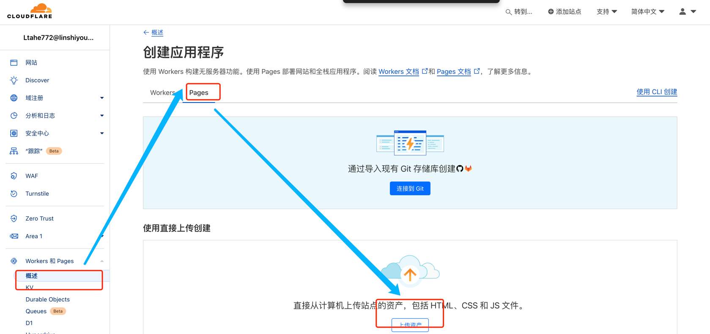
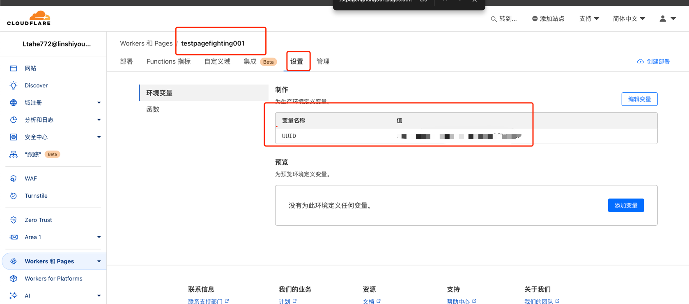
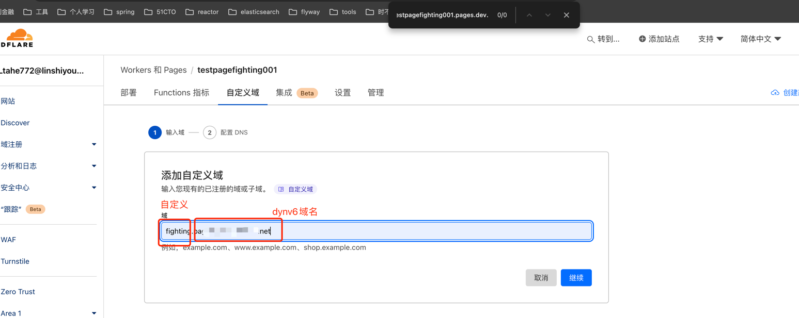
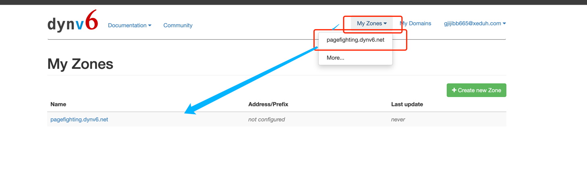
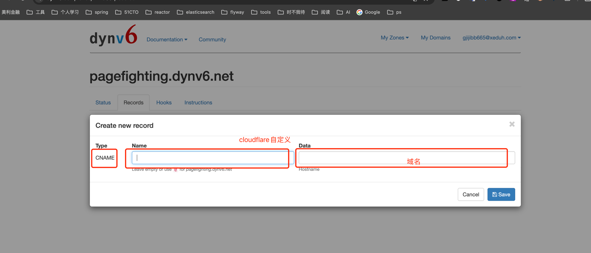
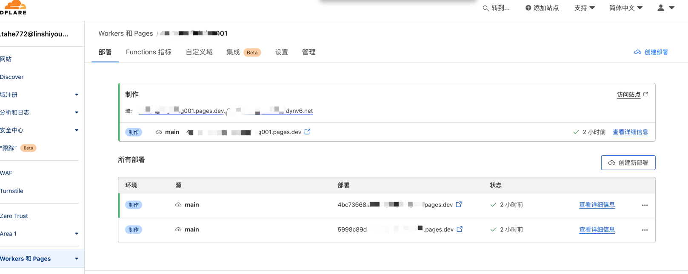
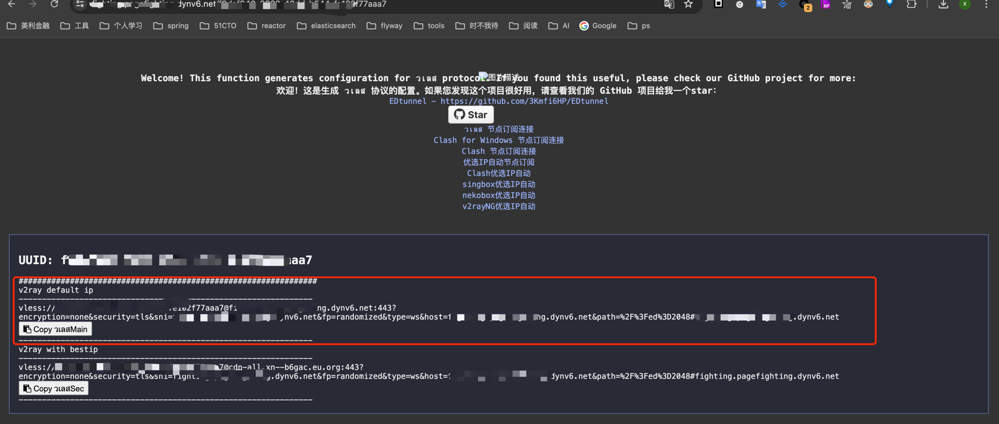

cloudflare warp无法使用 最新解决方法
> 日期： 六月 10, 2024
> 最近，cloudflare的免费vpn warp在国内大部分地区无法正常使用了。根据网络上的反馈情况来说，只要少部分地区warp的ipv6可以使用。并且，使用warp 
> ipv6节点需要你的本地有ipv6环境，并不是所有的地区宽带运营商都会给你分配ipv6，所以，我这里建议不要在使用warp了。可以使用cloudflare workers搭建免费节点来使用。通过cloudflare workers或者pages搭建免费节点的方式，已经稳定使用将近1年多没有出过问题了。

[视频教学](https://youtu.be/cqQioz_Kdag)

[cm代码](https://github.com/cmliu/edgetunnel)

[uuid在线生成](https://1024tools.com/uuid)

[v2rayN下载](https://github.com/2dust/v2rayN/releases/tag/6.45)

[dynv6免费域名](https://dynv6.com/)

> 将v2ray default ip复制到v2rayNG
